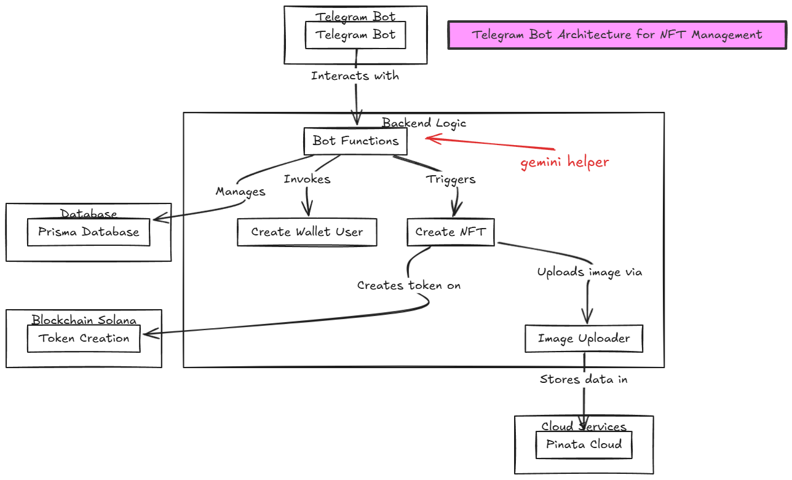

## Telegram Bot

create wallet , mint NFTs , generaaating tokens

## For creating the nft

I used Metaplex which simplifies the creation of NFTs by handling complex interactions with the Solana blockchain. Features include:

-Prebuilt token metadata program.
-Easy integration with IPFS.
-Faster development with UMI.

## Bot token

The Bot Token is an authorization token provided by Telegram when you create a bot using the BotFather.

## Tech Stack

-express
-geminiapi
-telegraf
-solWeb3.js
-Metaplex Lib for creating NFT
-Pinata for cloud storage
-Prisma for Database
