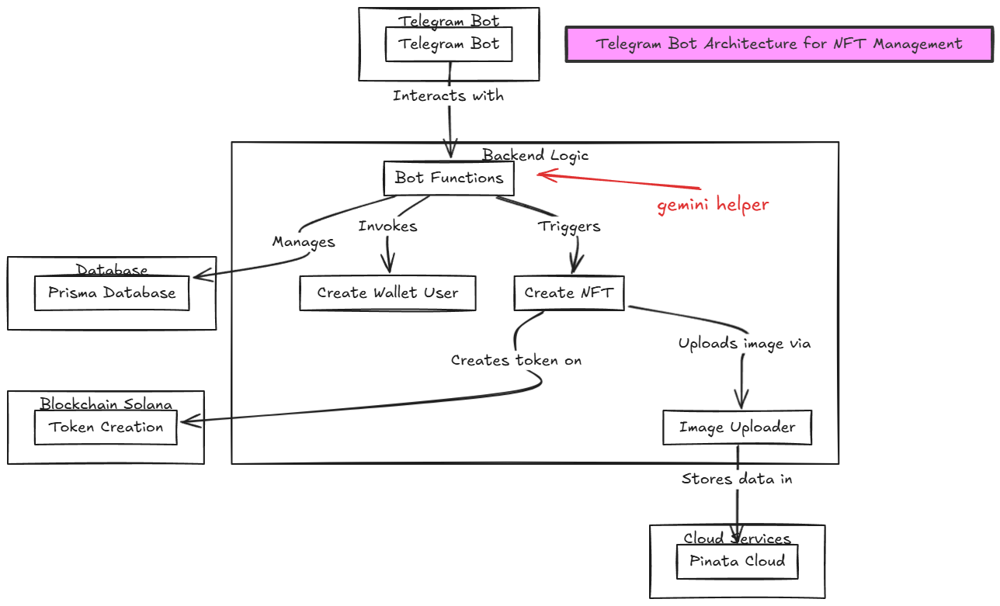
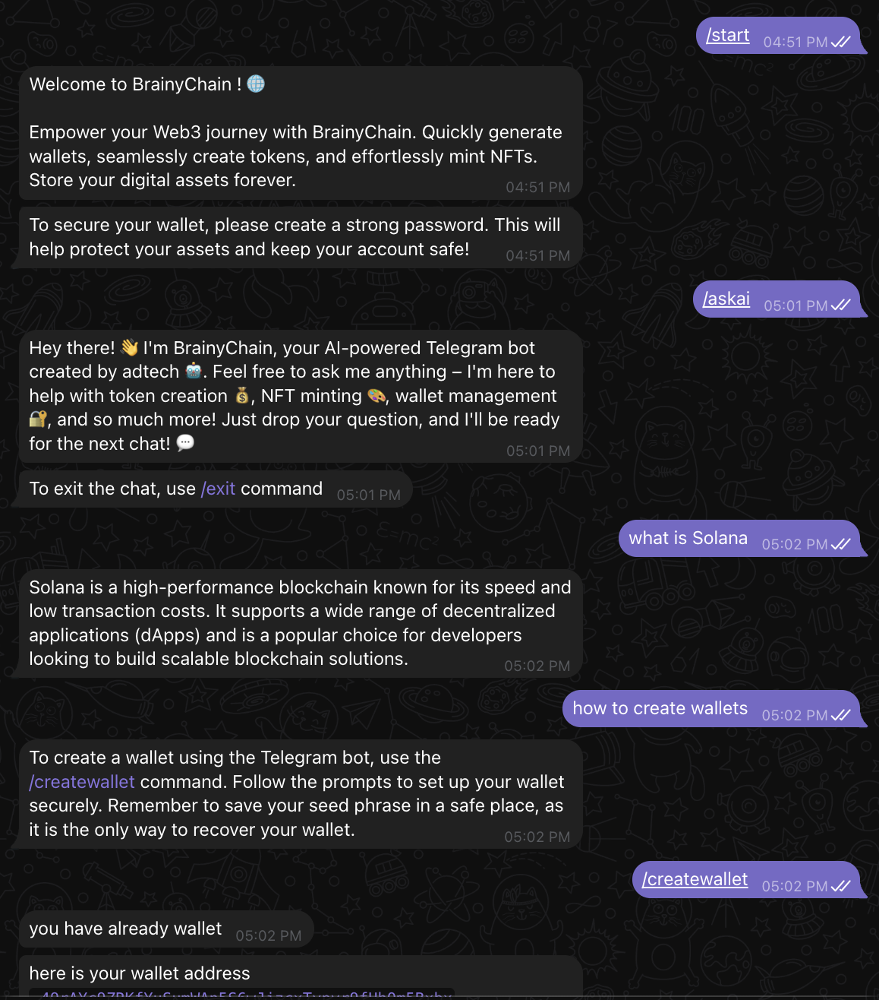

# BrainyChain.ai

Empower your Web3 journey with BrainyChain. Quickly generate wallets, seamlessly create tokens, and effortlessly mint NFTs. Store your digital assets forever.

## Overview

BrainyChain.ai is an AI-powered Telegram bot designed to assist you with creating a Solana wallet, generating tokens, and minting NFTs. It guides you through the process of interacting with the Solana blockchain and provides step-by-step instructions for creating tokens and NFTs. Whether you're new to blockchain or an experienced developer, this bot will help you easily navigate the world of Solana.


## How to Run the Bot

### Clone the Repo 

```bash 
git clone https://github.com/Anantdadhich/Brainychain.git

```


### Install Dependencies

```bash
cd backend
npm install
npm run dev
```

### Set Up Webhook URL

1. Expose your local server (e.g., using ngrok):

   ```bash
   npm i ngrok
   ngrok http 3000
   ```
2. Configure the Telegram webhook:

   ```bash
   curl -F "url=https://<your-ngrok-url>.ngrok.io" https://api.telegram.org/bot<YourBotToken>/setWebhook
   ```

### Environment Variables

Create a `.env` file in the `backend` directory with the following:

```env
BOT_TOKEN=""
GOOGLE_GEMINI_API=""
DATABASE_URL=""
PINATA_API_KEY=""
PINATA_SECRET_KEY=""
PINATA_JWT=""
WEBHOOK_URL=""
```

## Tech Stack

* Express.js
* Google Gemini API
* Telegraf (Telegram bot framework)
* @solana/web3.js
* Metaplex UMI (for NFT creation)
* Pinata (IPFS cloud storage)
* Prisma (database ORM)


## Architecture And Screenshots



